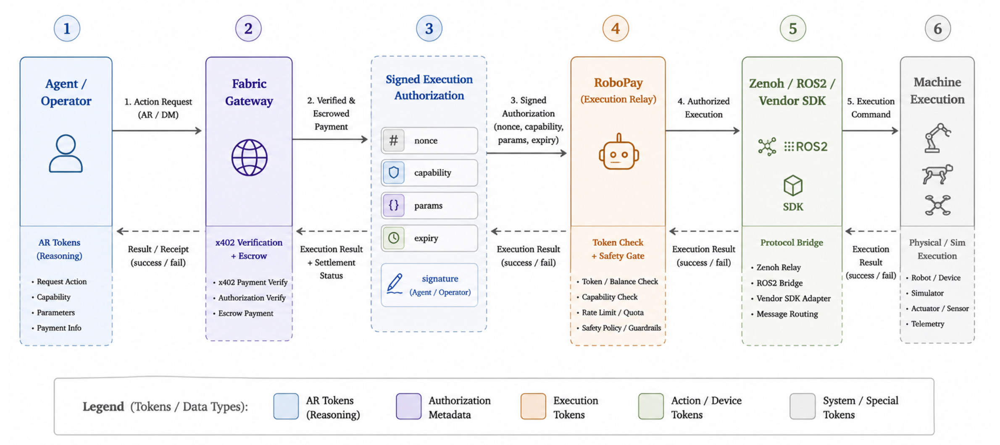

# RoboPay

Fabric RoboPay connects robots, simulators, cameras, drones, and other physical devices to the Fabric network. It provides a secure paid-action runtime that receives remote action requests, verifies payment through the robot-side tunnel flow, and routes approved actions to connected machines.

## Overview

Fabric introduces a payment layer for machines. RoboPay is the execution component of this stack, exposing machine capabilities as paid endpoints.

A core design principle is that **payment, routing, and execution are separated**. The Fabric backend/proxy receives a paid action request and routes it to the correct robot tunnel by `robotId`. It does not directly verify x402 payment in the production tunnel flow.

The robot-side `tunnel` receives the action request, runs x402 middleware, verifies or rejects the payment, and only publishes a verified action to the robot execution layer after successful verification. The robot controller still owns final safety — **a verified payment is not permission to move unconditionally**.



## Repository layout

```
.
├── tunnel/          # Go tunnel + x402 paid-action runtime
│   └── config.json  # robot_id, payee address, price, network
├── bridge/          # ROS2 bridge: Zenoh action events → robot /cmd_vel
│   ├── common/zenoh_bridge/                 # shared Zenoh + action parsing
│   └── unitree/{g1,go2,tron1}/isaac_sim_bridge/   # per-robot ROS2 packages
└── Makefile         # builds/runs the tunnel and the bridge
```

The simulator itself is **not** vendored here. Isaac Sim scenes and policies live in the [OM1-sim](https://github.com/OpenMind/OM1-sim) repo.

---

## 1. Start the simulator (Isaac Sim / OM1-sim)

The simulator lives in a separate repo, [OpenMind/OM1-sim](https://github.com/OpenMind/OM1-sim). It requires Ubuntu 22.04, ROS2 Humble, an NVIDIA GPU, and Isaac Sim 5.1.0+.

```bash
git clone https://github.com/OpenMind/OM1-sim.git
cd OM1-sim

export ISAACSIM_ROOT=/path/to/isaacsim
export RMW_IMPLEMENTATION=rmw_cyclonedds_cpp
source /opt/ros/humble/setup.bash
cd isaac_sim && "$ISAACSIM_ROOT/python.sh" run.py --robot_type g1
```

Press **▶ Play** in the GUI once the scene finishes loading. The sim subscribes to ROS2 `/cmd_vel` and drives the robot policy from it.

## 2. Start the bridge

The bridge is a ROS2 workspace under `bridge/`. It needs ROS2 Humble and a Python environment with `eclipse-zenoh`, managed with [uv](https://docs.astral.sh/uv/).

```bash
uv venv --python 3.10
source .venv/bin/activate
uv pip install eclipse-zenoh

make bridge-build
make bridge-run                 # defaults to G1; ROBOT=go2 or ROBOT=tron1 to switch
```

Package names are `isaac_sim_bridge_g1`, `isaac_sim_bridge_go2`, and `isaac_sim_bridge_tron1` (G1 is validated; Go2 and Tron1 are placeholders). The adapter subscribes to the Zenoh topic `robot/tunnel/action` and republishes mapped velocities on ROS2 `/cmd_vel`.

## 3. Start the tunnel

The tunnel (`tunnel/`) keeps an outbound WebSocket to the Fabric proxy, verifies x402 micropayments, and publishes accepted actions to the same Zenoh topic the bridge listens on.

Set the payee address (and any overrides) in `tunnel/config.json`:

```json
{
  "robot_id": "my-robot",
  "evm_payee_address": "0xYourAddress",
  "price": "$0.002",
  "network": "eip155:84532"
}
```

Build and run from the repo root (the `Makefile` operates inside `tunnel/`):

```bash
make build
make run
make test
```

Common environment overrides:

| Variable          | Default                                          | Description                       |
|-------------------|--------------------------------------------------|-----------------------------------|
| `PROXY_WS_URL`    | `wss://api.fabric.foundation/api/core/ws/robot`  | WebSocket URL of the tunnel proxy |
| `FACILITATOR_URL` | `https://x402.org/facilitator`                   | x402 payment facilitator endpoint |
| `GIN_MODE`        | `release`                                        | `debug` for verbose HTTP logs     |

Optional AIP agent registration (Unibase AIP network) is available behind `AIP_ENABLED=true`; see `tunnel/` sources for the full set of `AIP_*` variables.
